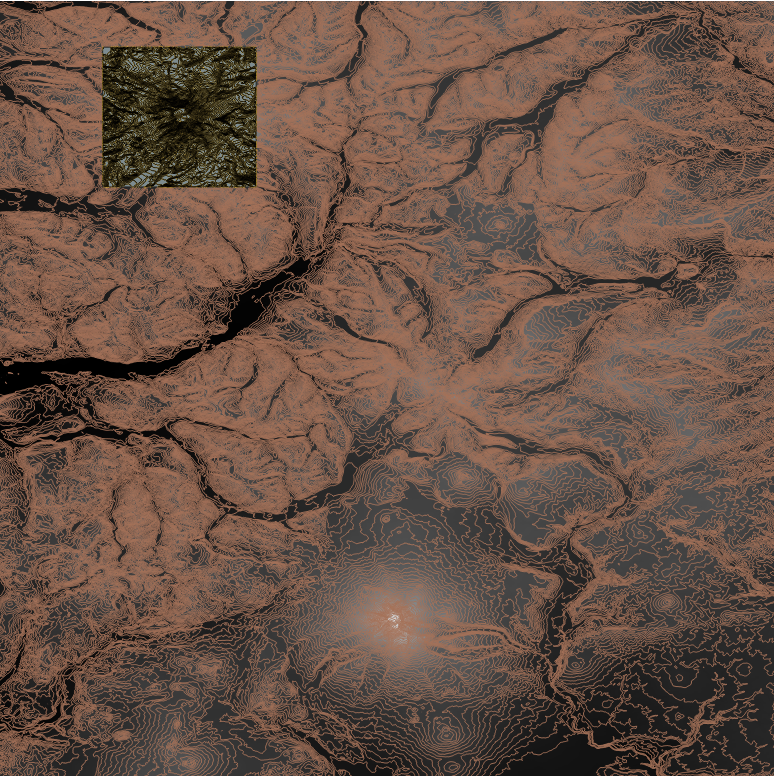
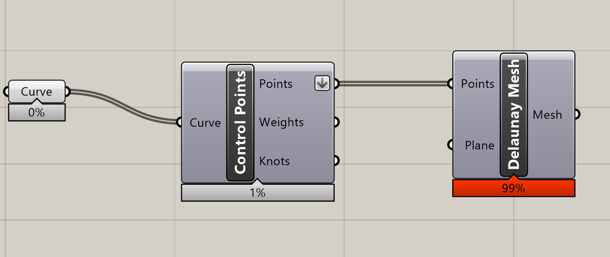
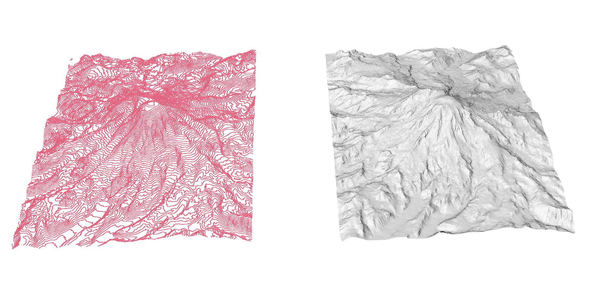

# topo-to-mesh
A guide to using DEM/Geo data to create contour lines in QGIS, and export those lines with elevation data into Rhino8. Using Grasshopper to convert those topo contour lines to mesh for external use.
# This is a QGIS to RHINO8/Grasshopper Pipeline Guide
Author: Andre Wonasue
About: Personal Project
## Pipeline
    Data > QGIS > Rhino8 > Grasshopper
## Issue Being Solved
- Some contour lines data in Rhino 8 do not include height elevation, and they stay on the same Z axis.
- This Guide is to help convert GeoTIF/DEM from USGS TNM to contour lines WITH elevation data included.
- Exporting from Qgis and Importing to Rhino8 WIth Z elevation.
- Unable to use digimaps we are stuck with USGS.
- (Very specific issue to me. Hope this guide helps)
# Data Source
- You can find data at 
- US: https://apps.nationalmap.gov/downloader/
- UK: https://digimap.edina.ac.uk/
- My Exact Example: https://apps.nationalmap.gov/downloader/#/elevation (Zoom into mount Rainier and hit search)
    ## Exporting Data
    - Custom Views -> Elevation
    - Area of interest -> Extend Tool (Choose your location)

# Softwares
- QGis (opensource) V.3.44 Baristalava
    1. Install Shape tools plugin fo rbnetter selection
- Rhino8 (EDU or Pro)
- Grasshopper (Rhino Free intergration)
- Any image viewer

 

## Download Geo Data
1. Download selected area on UGSS TNM map
- https://apps.nationalmap.gov/downloader/
    - Custom Views -> Elevation
    - Area of interest -> Extend Tool (Choose your location)
    - File Formats -> Geotiff or All
    - Search Product (Butrton)
    - Products Tab & Select the Large or mini areas
    - Hit the "Add To Cart" button
    - Cart Tab
    - Download "other formats(TIF)
    
     
    

    - Mount Rainier image-1.png
# ______________________________________________________________________________
# STEPS 
# QGIS Operation
2. Open Qgis
    - New Project
    - Add Layer > Add Raster Layer > Choose DEM/Tiff > OK
    - Raster (Top bars) > Extractions > Contour (With the B/W layer selected)
    - Set "Interval betwen contour lines" Ranging from 1-300+ (Dense to less dense)
    - Run (you will see contour Lines), 
    
    Optional:(You can change the colors)

## Sub Area Selection (smaller segment)
3. Selection
    - Layer > Create Layer > New Temporary Scratch Layer
    - Geomentry type = Polygon
    - OK
    - Toggle Editing on layer, If its off (Pencil icon)
    - View > Toolbars > Digitizing Toolbar
    - Add Polygon (golf course looking) > Digitize Shape > Or Rectangluar Select

## Clipping Contours /w New Selection
4. Clip
    - Vector > Geoprocessing tools > Clip
    - INPUT LAYER = Contours
    - OVERLAY LAYER = New scratch layer (or whatever you named that layer)
    - RUN
    
    Optional: Hide all other layers except clipped
    
    

## Z Depth Elevation (Crucial Part)
5. SET Z + Split Vector Layer
    - Right click "Clipped" layer > Properties > Fields or Attribute forms
    - Find ELEV in the table (Checking entities)
    - Processing > Tools 
    - Search: [Set Z Value] apply on [ClippedLayer]
        1. INPUT LAYER = [Clipped]
        2. Z Value = Field Type > [ELEV]
        3. Z Added is created
    - Processing > Tool
    - Search: [Split Vector Layer] apply on [Z Added]
        1. INPUT LAYER = [Z Added]
        2. UNIQUE ID FIELD = [ELEV]
    - Right click [Z Added] > Export > Save Features As
        1. FORMAT = AutoCAD DXF
        2. Location/name (USER BASED)
        3. CRS = "EPSG:#####-WGS 84 / UTM zone". Refer below to learn about CRS
        4. Ok
    - Wait a bit for a pop up
    - Click the ? on the new layer and set the CRS again

6. Export
    - Project > Import/Export > Export Project to DXF > Select THe entities one > Done

## CRS- Coordinate Reference System (IMPORTANT)
- We are looking for the UTM zone for the general location the DEM came from.
- Search "UTM zone [StateName] EPSG
- Look for the "Used for mapping/GPS in [StateName]
- https://docs.qgis.org/3.44/en/docs/gentle_gis_introduction/coordinate_reference_systems.html
- Find epsg coords: https://epsg.io/

# Rhino/Grasshopper Operations
- Import the DXF into Rhino 8 in Meters
- Open Grasshopper
- 3 Node setup. Curve > Control Points > Delaunay Mesh
- Flatten the Points Export socket before into Delaunay Mesh Points Input

# Resource Links
- https://qgis.org/resources/hub/
- https://apps.nationalmap.gov/help/
- https://www.grasshopper3d.com/
- 
- https://epsg.io/
